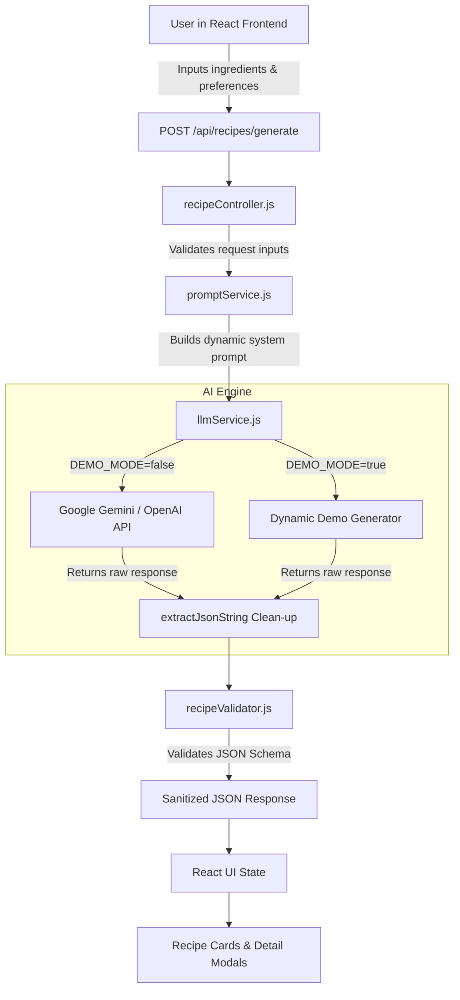

# 🍳 RecipeGen AI — Recipe Generator from Ingredients

An intelligent full-stack web application powered by Large Language Models (LLMs) that turns your available kitchen ingredients into delicious, personalized recipes.

---

## 📖 Table of Contents
- [Problem Statement](#-problem-statement)
- [Proposed Solution](#-proposed-solution)
- [Key Features](#-key-features)
- [AI / LLM Architecture](#-ai--llm-architecture)
- [Technology Stack](#-technology-stack)
- [Project Folder Structure](#-project-folder-structure)
- [Installation & Setup](#-installation--setup)
- [Environment Variables](#-environment-variables)
- [Running the Application](#-running-the-application)
- [API Documentation](#-api-documentation)
- [Example Inputs & Outputs](#-example-inputs--outputs)
- [Error Handling & Demo Mode](#-error-handling--demo-mode)
- [Future Improvements](#-future-improvements)

---

## 🎯 Problem Statement
Every day, millions of households face the classic kitchen dilemma: *"What can I cook with the ingredients I already have?"*
Traditional recipe search engines require users to search by specific dish names and often return recipes requiring dozens of exotic ingredients, resulting in food waste, unnecessary grocery store trips, and decision fatigue.

---

## 💡 Proposed Solution
**RecipeGen AI** empowers users to simply input the random ingredients sitting in their fridge or pantry (e.g., tomato, onion, egg, rice), select their dietary constraints, and let an advanced LLM dynamically formulate realistic, chef-quality recipes with exact step-by-step cooking procedures, missing pantry alerts, and smart ingredient substitutions.

---

## ✨ Key Features

1. **Tag-Based Ingredient Input**:
   - Add ingredients one by one or via comma-separated text.
   - Remove individual tags or clear all in one click.
   - Quick-fill preset ingredient combinations from sample data.
   - Prevents empty submissions.

2. **Customizable Culinary Preferences**:
   - **Diet**: Vegetarian, Non-Vegetarian, Vegan, Any.
   - **Cuisine**: Indian, South Indian, North Indian, Italian, Chinese, Mexican, Any.
   - **Difficulty**: Easy, Medium, Hard, Any.
   - **Max Cooking Time**: 15 mins (Express), 30 mins, 45 mins, 60+ mins, Any.
   - **Servings**: 1, 2, 4, 6+ people.

3. **Intelligent LLM Recipe Generation**:
   - Maximizes use of existing ingredients.
   - Accurately distinguishes **available ingredients** vs **missing staples** (e.g. oil, salt).
   - Generates 3 unique recipe variations.
   - Produces structured JSON strictly adhering to schema constraints.

4. **Rich Recipe Details Modal**:
   - Exact quantities and measurements for each ingredient.
   - Numbered step-by-step cooking directions.
   - Smart culinary substitutions (e.g., butter ➔ olive oil).
   - Pro chef cooking tips.

5. **Client-Side Bookmark / Save & Copy**:
   - Save favorite recipes directly to browser `localStorage`.
   - Dedicated Saved Recipes drawer to view or delete anytime.
   - One-click copy formatted recipe to clipboard.

6. **Zero-Setup Demo Simulator (`DEMO_MODE=true`)**:
   - Enables out-of-the-box evaluation and testing even without an external API key.

---

## 🧠 AI / LLM Architecture



---

## 🛠️ Technology Stack

- **Frontend**:
  - React 18
  - Vite
  - Lucide React (Clean vector icons)
  - Vanilla CSS3 Design System (Glassmorphism, responsive grid, animations)
- **Backend**:
  - Node.js (v18+)
  - Express.js
  - `@google/generative-ai` (Official Google Gemini SDK)
  - `cors`, `dotenv`
- **Storage**:
  - Browser `localStorage` for offline bookmarking.

---

## 📁 Project Folder Structure

```
RecipeGen AI/
├── backend/
│   ├── controllers/
│   │   └── recipeController.js      # Request validation & workflow coordination
│   ├── routes/
│   │   └── recipeRoutes.js          # Express API route endpoints
│   ├── services/
│   │   ├── llmService.js            # LLM API caller & Demo mode engine
│   │   └── promptService.js         # Dynamic prompt construction
│   ├── utils/
│   │   └── recipeValidator.js       # JSON schema validator and sanitizer
│   ├── .env.example                 # Environment template
│   ├── .env                         # Server environment variables
│   ├── package.json                 # Backend dependencies & scripts
│   └── server.js                    # Express app entry point
├── frontend/
│   ├── src/
│   │   ├── components/
│   │   │   ├── IngredientInput.jsx  # Interactive tag & chip input
│   │   │   ├── PreferenceForm.jsx   # Dietary & cuisine dropdowns
│   │   │   ├── RecipeCard.jsx       # Result overview card
│   │   │   ├── RecipeDetails.jsx    # Full modal with instructions & tips
│   │   │   ├── SavedRecipesModal.jsx# LocalStorage saved drawer
│   │   │   └── Loading.jsx          # Animated cooking spinner
│   │   ├── pages/
│   │   │   └── Home.jsx             # Main interactive application page
│   │   ├── services/
│   │   │   └── api.js               # Frontend fetch client
│   │   ├── App.jsx
│   │   ├── main.jsx
│   │   └── index.css                # Custom CSS design system
│   ├── index.html
│   ├── package.json                 # Frontend dependencies
│   └── vite.config.js               # Vite config with proxy
├── data/
│   └── sample_ingredients.json      # Preset pantry bundles for quick test
├── prompts/
│   └── recipePrompt.txt             # Reference prompt template
├── .gitignore
└── README.md
```

---

## ⚙️ Installation & Setup

### Prerequisites
- Node.js (v18 or higher)
- npm

### 1. Clone or Open the Repository
```bash
cd "d:/RecipeGen AI"
```

### 2. Install Backend Dependencies
```bash
cd backend
npm install
```

### 3. Install Frontend Dependencies
```bash
cd ../frontend
npm install
```

---

## 🔐 Environment Variables

Inside `backend/.env`:

```env
# Server Port
PORT=5000

# Google Gemini API Key (Get free key at: https://aistudio.google.com/)
GEMINI_API_KEY=your_gemini_api_key_here

# Demo Mode (true = dynamic local generator without API key, false = real LLM)
DEMO_MODE=false
```

> **Security Note**: Never expose your LLM API keys to the frontend repository. All API keys reside strictly on the backend.

---

## 🚀 Running the Application

### Start the Backend Server (Port 5000)
```bash
cd backend
npm run dev
# Or: node server.js
```

### Start the Frontend Dev Server (Port 5173)
In a separate terminal:
```bash
cd frontend
npm run dev
```
Open **http://localhost:5173** in your browser!

---

## 📡 API Documentation

### 1. Generate Recipes
**`POST /api/recipes/generate`**

#### Request Headers:
`Content-Type: application/json`

#### Request Body:
```json
{
  "ingredients": ["tomato", "onion", "egg", "rice", "green chilli"],
  "preferences": {
    "diet": "Non-Vegetarian",
    "cuisine": "South Indian",
    "difficulty": "Easy",
    "maxTime": "30",
    "servings": "2"
  }
}
```

#### Response Body (200 OK):
```json
{
  "success": true,
  "count": 3,
  "isDemo": false,
  "recipes": [
    {
      "id": "recipe-1-m3a9",
      "name": "Quick Egg & Tomato Fried Rice",
      "description": "A fragrant South Indian inspired stir-fried rice tossed with scrambled eggs, juicy tomatoes, and green chillies.",
      "cuisine": "South Indian",
      "diet": "Non-Vegetarian",
      "difficulty": "Easy",
      "cooking_time_minutes": 20,
      "servings": 2,
      "available_ingredients": ["tomato", "onion", "egg", "rice", "green chilli"],
      "missing_ingredients": ["cooking oil", "mustard seeds", "salt"],
      "ingredients": [
        { "name": "Cooked Rice", "quantity": "2 cups" },
        { "name": "Eggs", "quantity": "2 large" },
        { "name": "Tomato", "quantity": "1 medium, diced" },
        { "name": "Onion", "quantity": "1 medium, sliced" },
        { "name": "Green Chilli", "quantity": "2 slit" },
        { "name": "Oil", "quantity": "1.5 tbsp" },
        { "name": "Salt", "quantity": "to taste" }
      ],
      "steps": [
        "Heat oil in a wok or pan over medium heat.",
        "Sauté sliced onions and slit green chillies until onions turn translucent.",
        "Add chopped tomatoes and cook until soft and pulpy.",
        "Push aromatics to one side, crack the eggs into the pan, and scramble until gently set.",
        "Toss in the cooked rice and salt; mix thoroughly over high heat for 2 minutes.",
        "Serve hot with a side of yogurt or pickle."
      ],
      "substitutions": [
        { "original": "Cooked Rice", "replacement": "Leftover millets or quinoa" },
        { "original": "Green chilli", "replacement": "Black pepper powder" }
      ],
      "tips": [
        "Use cold leftover rice so the grains stay separate and do not become mushy."
      ]
    }
  ]
}
```

### 2. Get Sample Ingredients
**`GET /api/recipes/samples`**
Returns curated pantry combinations for one-click testing.

### 3. Server Status
**`GET /api/recipes/status`**
Returns server status, active AI provider, and DEMO_MODE setting.

---

## 🛡️ Error Handling & Demo Mode

The application handles edge cases cleanly:
- **Empty or Whitespace Inputs**: Blocked at frontend and returns 400 Bad Request if bypassed.
- **LLM Rate Limits / Network Outages**: Returns friendly 502 Bad Gateway with recovery guidance.
- **Malformed LLM Output**: Safe regex JSON extraction strips markdown code fences (` ```json `), and `recipeValidator` ensures all schema fields exist with healthy fallbacks.
- **Zero API Key Out-of-the-Box Experience**: Setting `DEMO_MODE=true` generates contextual recipes based on the exact ingredients supplied without external network requirements.

---

## 🔮 Future Improvements
- 📸 Photo ingredient recognition using Gemini Multimodal Vision API.
- 🖨️ PDF export for recipe shopping lists.
- 🥗 Detailed nutritional estimation (calories, proteins, carbs).
- 🎙️ Voice input for adding ingredients hands-free while cooking.
